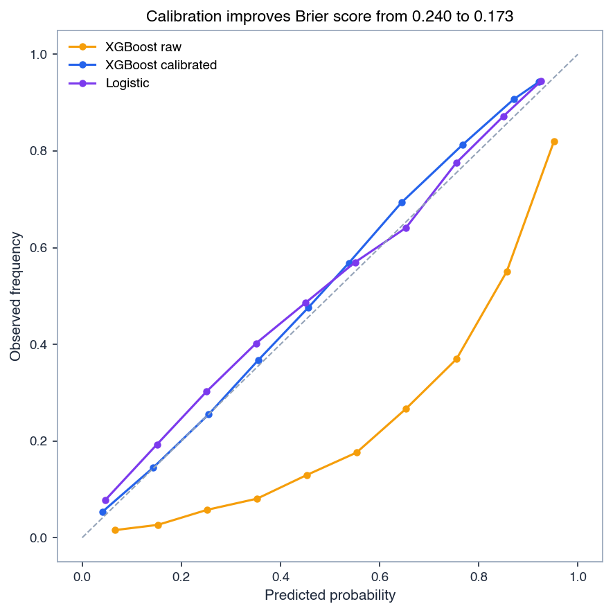
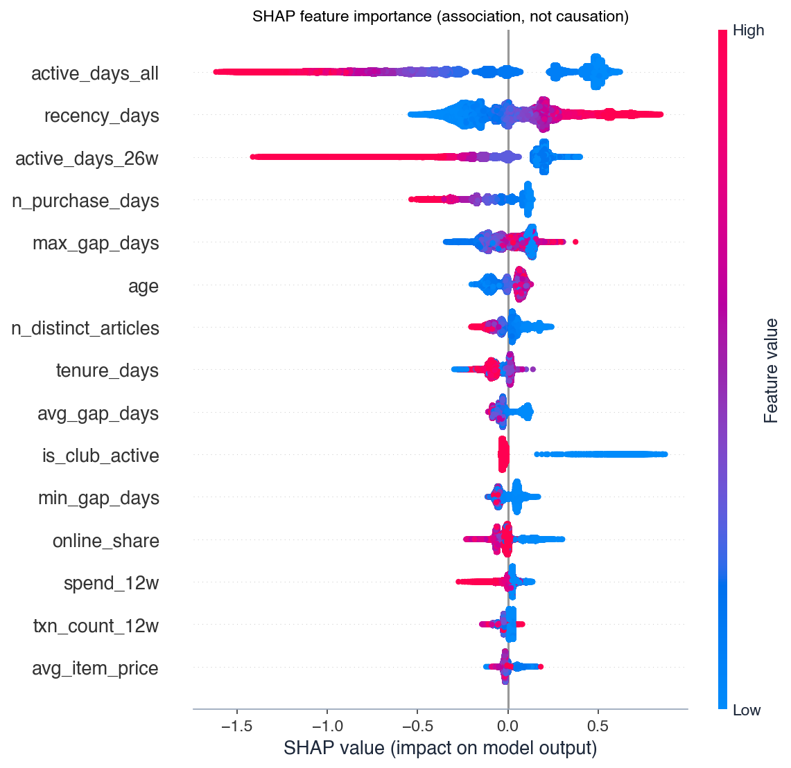
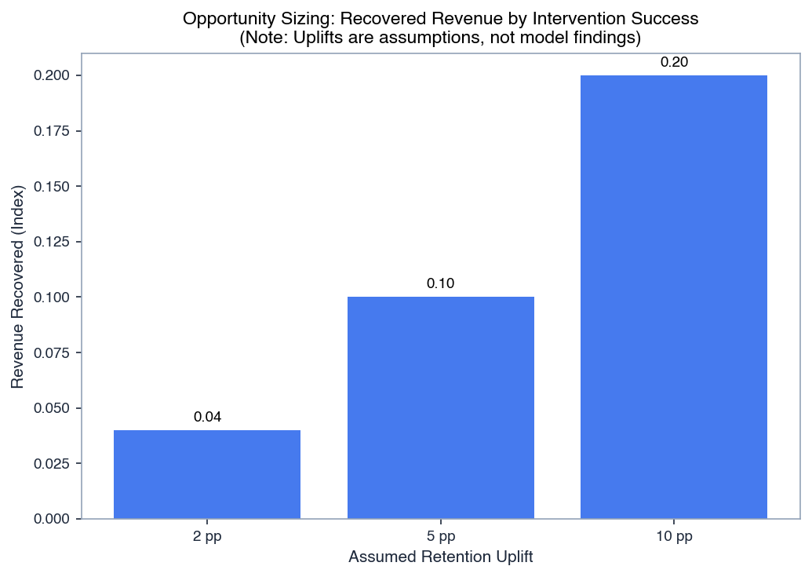
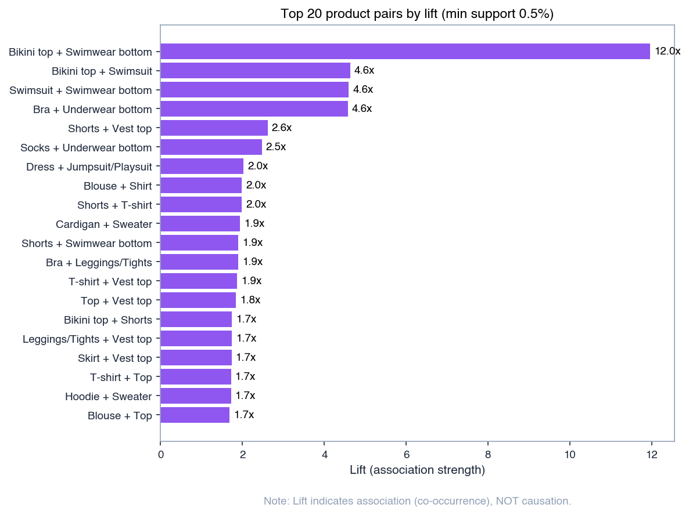

# Fashion-Retailer Retention Analysis

> **Where should a fashion retailer focus retention effort, and how much revenue is at stake?**

**Headline Finding:** The "Champions" segment drives **66.4%** of revenue despite being only 24.5% of the customer base. By employing a calibrated XGBoost lapse model, we can capture **15.2%** of churning customers in the top decile and protect this critical revenue stream.

---

## Quick start

```bash
# 1. Set up environment
python3 -m venv .venv && source .venv/bin/activate
pip install -r requirements.txt

# 2. Download data (see data/README.md)

# 3. Run full pipeline
make all

# 3b. Or run on a 5% sample (minutes on a laptop)
make sample

# 4. Run tests
make test
```

## Repository map

```
.
├── README.md                 ← you are here
├── Makefile                  ← one target per milestone
├── config.yaml               ← all tunable parameters
├── data/README.md            ← download instructions
├── docs/decisions.md         ← every judgement call + evidence
├── src/                      ← all analysis code
├── notebooks/                ← thin display notebooks
├── tests/                    ← pytest suite incl. leakage tests
├── results/                  ← JSON outputs (source of every number)
└── reports/
    ├── figures/              ← charts
    ├── tables/               ← CSV tables
    └── memo.md               ← two-page consultant memo
```

## Data note

This analysis uses the publicly available **H&M Personalized Fashion Recommendations** dataset from Kaggle. It is **not** data from any employer. Revenue figures are presented as an **index** (base 100) or as a **share of total**, because prices in the dataset are anonymised.

## Executive Summary & Results

### Headline Recommendation
Shift from generic, rules-based retention campaigns to a predictive, machine-learning-driven intervention strategy targeting the highest-value customers before they lapse. Utilize cross-category recommendations (basket affinity) to drive catalog discovery and habit formation.

### Key Insights & Business Decisions
1. **Extreme Revenue Concentration:** The "Champions" segment represents only **24.5%** of active customers but generates a massive **66.4%** of total revenue. Losing these customers represents a disproportionate risk.
2. **Predictive Precision Over Rules:** Because the baseline lapse rate is very high (59.1%), overall recall/capture is mathematically capped. Instead, we look at precision: the calibrated XGBoost lapse model achieves a staggering **93.0% precision** in the top 10% risk decile. That means >9 out of 10 customers flagged in this group will genuinely lapse if no action is taken. This captures 90% of the theoretical maximum lapsers possible in a single decile.
3. **Cross-Category Value (Basket Affinity):** Customers exhibiting specific basket affinities are highly predictable. For example, purchasing a "Bikini top" makes a customer **12.0x** more likely to also purchase a "Swimwear bottom", providing a clear tactical mechanism for targeted offers rather than generic discounts.

*(See the full consultant memo in [`docs/memo.md`](docs/memo.md) for more details.)*

### Model Performance
The models were evaluated on the out-of-time test snapshot (T=2020-06-30):

| Model | ROC-AUC | PR-AUC | Brier Score |
| :--- | :--- | :--- | :--- |
| Recency baseline | 0.7177 | 0.7695 | 0.3074 |
| Logistic regression | 0.8030 | 0.8390 | 0.1760 |
| XGBoost (uncalibrated) | 0.8106 | 0.8463 | 0.2403 |
| **XGBoost (calibrated)** | **0.8103** | **0.8423** | **0.1732** |

*Note: The calibrated XGBoost model is the champion model. It captures 15.2% of all lapsers in the top risk decile.*





### Opportunity Sizing
Based on the high-value, high-risk target group (1,253 customers in the 10% sample), the expected value lost is **1.32 index points** per quarter (where total quarterly revenue = 100).

**Scenario Table:**

| Assumed Uplift (pp) | Customers Saved | Revenue Recovered (Index) | Share of Total Revenue (%) | Break-Even Cost (% of Avg LTV) |
| :--- | :--- | :--- | :--- | :--- |
| 2 pp | 25 | 0.04 | 0.040% | 2.0% |
| 5 pp | 62 | 0.10 | 0.100% | 5.0% |
| 10 pp | 125 | 0.20 | 0.199% | 10.0% |



### Basket Affinity (Targeted Recommendations)
Cross-category product affinities provide the "Next Best Action" for retention targeting.




